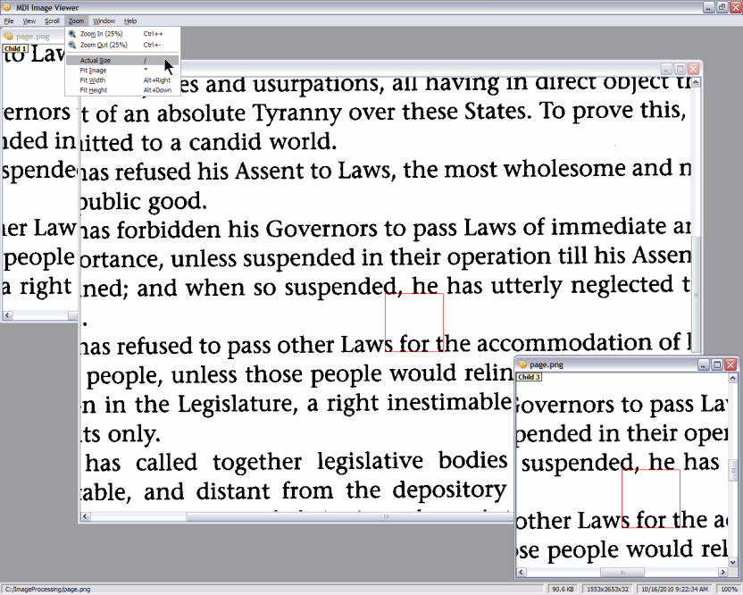
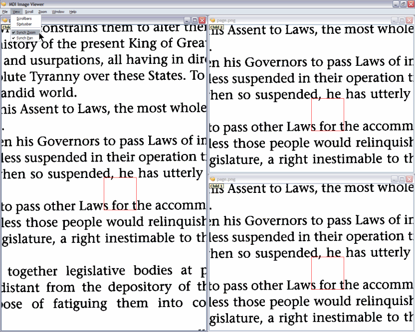
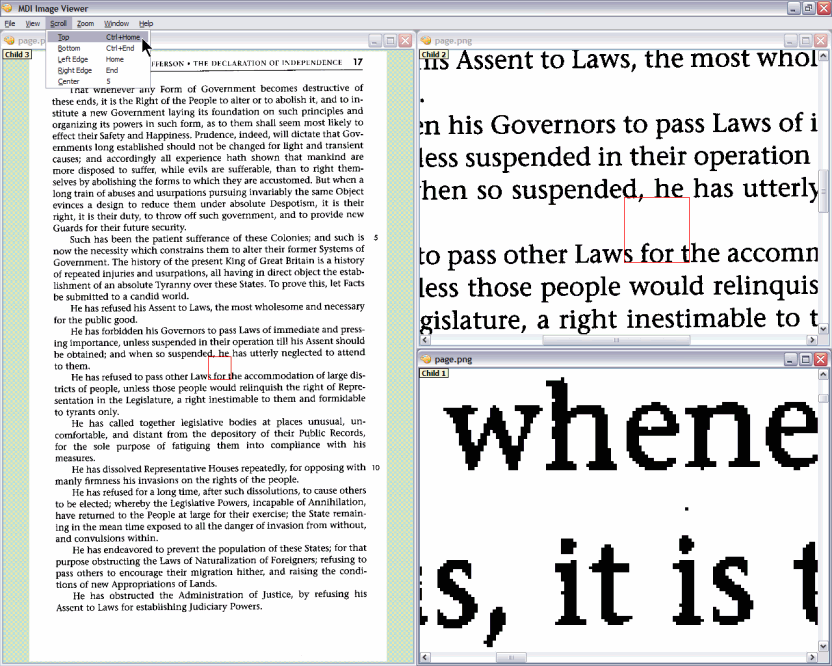

:version: $RCSfile: index.rst,v $ $Revision: 693361f85272 $ $Date: 2010/08/23 15:08:52 $
:orphan:

=======================
 PyQt MDI Image Viewer
=======================

   
This is the documentation for the PyQt based `MDI (Multiple Document
Interface) Image Viewer <http://github.com/tpgit/MDIImageViewer>`_ which
supports optional zooming and panning synchronization of multiple
windows. I've tested it under Windows XP using `ActiveState Python 2.6.4
<http://www.activestate.com/activepython/downloads>`_ and PyQt 4.7.7 and
`PyQt 4.8 <http://www.riverbankcomputing.co.uk/software/pyqt/intro>`_.

As you can see from the thumbnail images on the right (click the
thumbnails to see larger versions), the MDI Image Viewer supports
standard tiled or independent subwindows. Each subwindow can be forced
to have the same zoom factor and position (helpful when trying to
examine the exact changes caused by image processing
operations). Alternatively, the subwindows can be scaled independently
and show different areas.

Holding down the :kbd:`<Space>` key lets you pan a subwindow by dragging
the mouse.

In and of itself, the MDI Image Viewer is admittedly not particularly
useful. It was written mainly as a component for an upcoming image
processing application, but also as an exercise in "correct" application
development using the following:

+ `PyQt <http://www.riverbankcomputing.co.uk/software/pyqt/intro>`_
  programming

+ `Qt <http://qt.nokia.com/>`_ programming

+ `Python <http://python.org/>`_ programming

+ `Sphinx <http://sphinx.pocoo.org/index.html>`_ documentation

+ Project hosting on `github <http://github.com/>`_

See the :doc:`Implementation Notes <implementation>` page for detailed
descriptions of the various techniques demonstrated by this
project.

Also included is detailed documentation of the :doc:`Python modules
<modules>`.

You can easily start your own PyQt application by copying the files from
the `github repository
<http://github.com/tpgit/MDIImageViewer/archives/master>`_.

For more information, continue on to the complete :doc:`Documentation
<contents>`.

..
   Local Variables:
   coding: utf-8
   mode: rst
   indent-tabs-mode: nil
   sentence-end-double-space: t
   fill-column: 72
   mode: auto-fill
   standard-indent: 3
   tab-stop-list: (3 6 9 12 15 18 21 24 27 30 33 36 39 42 45 48 51 54 57 60)
   End:
